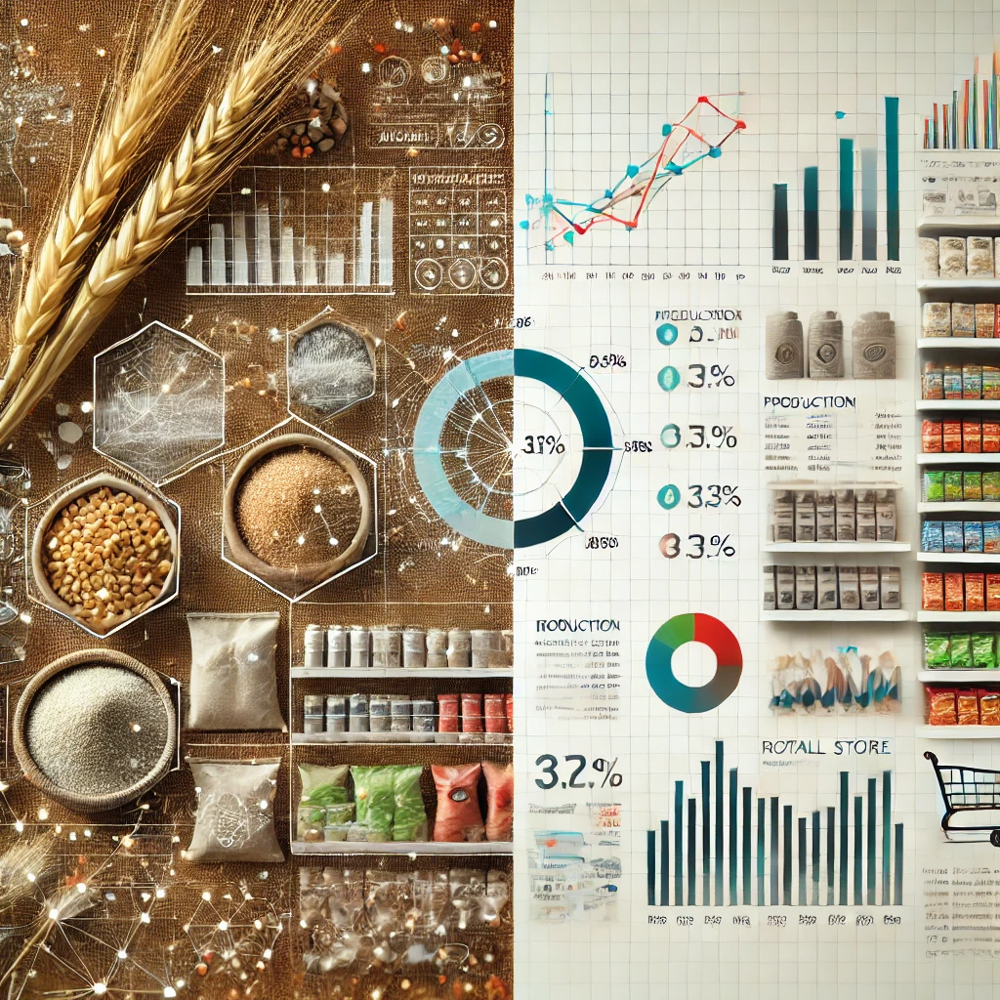

### Contenido:

Este repositorio contiene trabajos realizados como analista de datos utilizando Excel y Google Sheets. Incluye análisis con aportes en dos áreas: **análisis de granos** ( en excel) y **gestión de una tienda de retail**  (en google sheet), proporcionando información valiosa para la toma de decisiones.

  

[Enlace al proyecto de los granos en Excel ](./Analisis-produccion-granos-Arg-1981_2020/entrega_proyecto%20_LARA_LEDESMA.xlsx)

[Enlace a la documentaciòn del proyecto del analisis de la tienda de retail en google sheet](./Global-Super-Store/Conclusiones%20-%20Proyecto%20M1,%20Ledesma,Lara_.docx)

---
